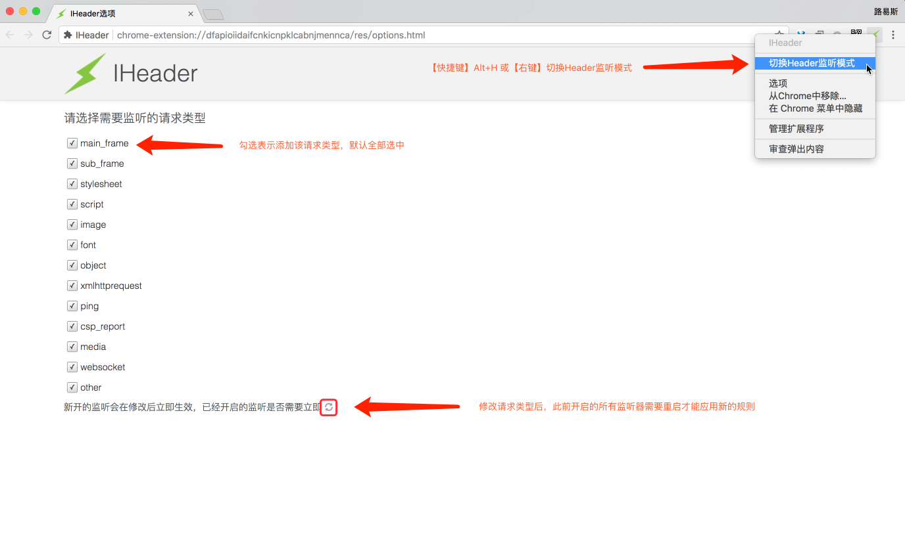
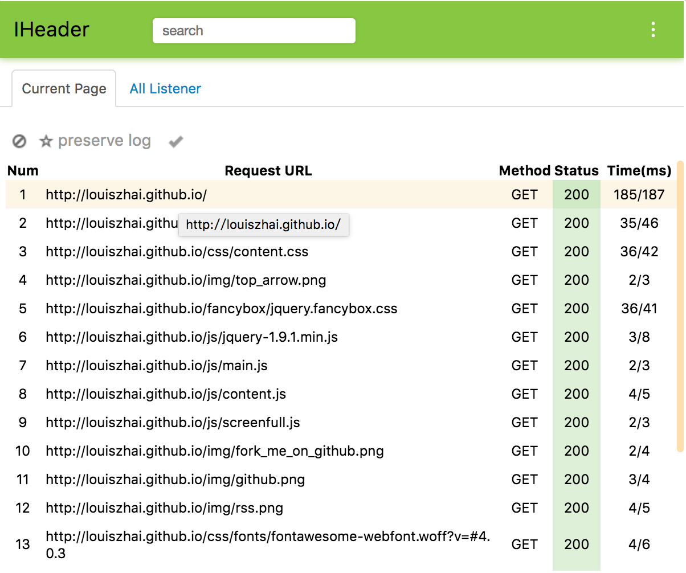
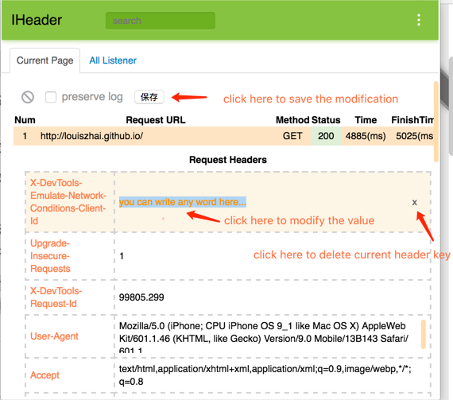
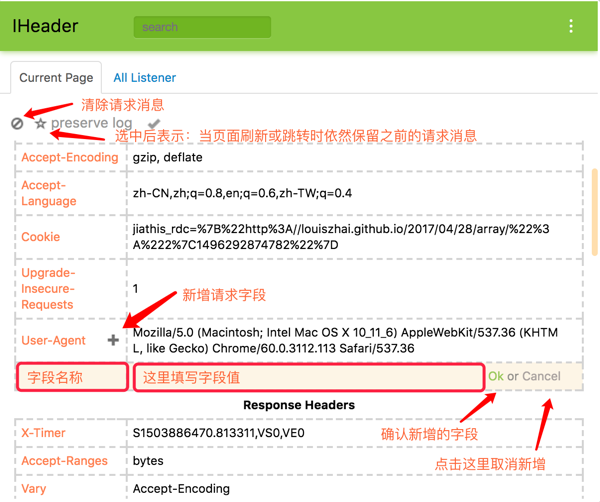
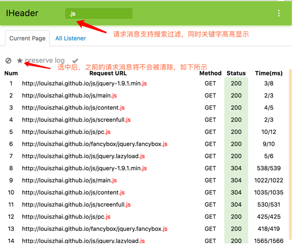
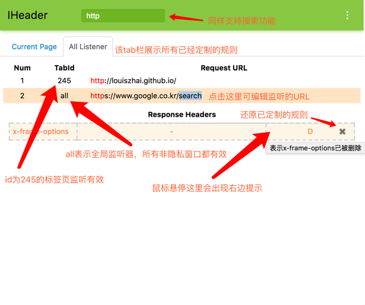

<a target="_blank" href="https://chrome.google.com/webstore/detail/iheader/polajedphjkpjbfljoabmcejpcckeked?utm_source=chrome-ntp-icon"></a>

# IHeader


switch to [README_en.md](https://github.com/Louiszhai/IHeader/blob/master/README_en.md)

Author: louis

Blog: http://louiszhai.github.io

Github: http://github.com/Louiszhai/IHeader

该扩展主要用于监听页面请求响应头，从而达到添加、删除或修改域字段目的。请求头和响应头字段的修改符合以下规则：

> Chrome对于请求头和响应头的展示有着明确的规定，即控制台中只展示发送出去或刚接收到的字段。因此编辑后的请求字段，控制台的network栏能够正常展示；而编辑后的响应字段由于不属于刚接收到的字段，所以从控制台上就会看不到编辑的痕迹，如同没修改过一样，实际上编辑仍然有效。

对于请求头而言，**部分缓存有关的字段**（Authorization、Cache-Control、Connection、Content-
Length、Host、If-Modified-Since、If-None-Match、If-Range、Partial-Data、Pragma、Proxy-
Authorization、Proxy-Connection和Transfer-Encoding）不会出现在请求信息中，可以通过添加同名的key覆盖修改其值，但是不能删除它。

对于响应头而言，只能修改或删除非缓存相关字段或添加字段，由于响应头允许多个同名字段同时存在，因此无法覆盖修改缓存相关的字段。

## Feature

现在，IHeader支持以下功能：

1. 支持request headers的增删改查。
2. 支持Tab内request列表、已定制规则列表的搜索过滤。
3. 支持一键清除Tab内的所有request记录。
4. 支持新增或删除全局规则。
5. 支持修改已定制规则的URL。
6. 支持自动补全CORS相关的响应头，开启Tab页的监听后，相当于自动设置`Access-Control-Allow-Origin:*`。
7. 支持域名代理-Proxy（点击扩展页面右上角——弹出Host Proxy Settings，即可定制代理）。

## Clone

```
git clone git@github.com:Louiszhai/IHeader.git
```

## Install

请在 [IHeader - 谷歌商店](https://chrome.google.com/webstore/detail/iheader/polajedphjkpjbfljoabmcejpcckeked?utm_source=chrome-ntp-icon) 中安装它。

或者下载Github源码，点击`chrome://extensions/`页面的`加载已解压的扩展程序`按钮，选择源码目录以调试模式运行（由于Github源码更新比较及时，因此推荐这种安装方式）。

## Guide

IHeader扩展默认的快捷键是`Alt+H`，按下该快捷键可以切换当前Tab监听的状态（开启或关闭）。如果你忘了快捷键，记得还有一个右键菜单可以做同样的事情。

根据我的设置，所有的请求使用一致的过滤规则，这些过滤规则可以在选项页面重新设置。

请务必注意，当你修改过滤规则时，已经启用的监听器需要重启才能让新的规则生效。以上内容，如下图所示。



监听开启后，扩展能够自动记录当前页面的请求，如下所示：



对于以上请求列表的每项，我们都可以新增、修改或者删除一些HTTP字段来定制它。定制规则共有两种生效方式：①当前标签页有效（默认），②全局有效，如下所示：



另外，这些请求列表不是一直在这的，默认情况下，每次页面刷新或者跳转，之前的请求记录都会被清除，你可以通过勾选多选框，来取消默认动作，从而使得这些请求记录都被保存下来。如果希望马上清除所有的请求记录，点击以下的清除按钮就行。



请求列表同时支持搜索功能，匹配到的请求将会被筛选出来，同时匹配文本也会高亮显示。



此外，扩展包含另外一个tab栏来显示所有定制的规则，你可以选中一个定制的规则并且移除它。还可以在定制的基础上修改监听的URL，避免部分请求的URL末尾参数的变化导致监听失败。目前，对于请求URL的匹配，仅支持包含匹配（暂不引入正则匹配，这是为了避免使用中出现复杂低效的正则表达式，从而影响到Chrome中请求的加载速度）。

以下，type值为"A/M"的意味着新增或修改的字段（缓存有关字段的新增和修改场景无法区分，所以合并展示）。

type值为"D"的意味着删除的字段。



使用过程中如有任何疑问或需求，欢迎随时向我提issue，喜欢请轻点star。

IHeader的开发思路和源码解析请戳[Chrome扩展开发—定制HTTP请求响应头域](http://louiszhai.github.io/2017/11/14/iheader/)（该文章已被《程序员》杂志收录）。

## License

Released under [MIT](http://rem.mit-license.org/)  LICENSE.